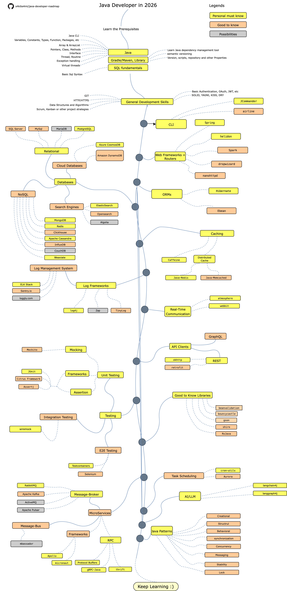

# Java Developer Roadmap

  

> #### Subera is a software engineering partner for teams that need reliable backend systems, clean architecture, and production discipline from day one. [Contact Us](https://suberahq.com?utm_source=github)

> Roadmap to becoming a [Java](https://g.co/kgs/bzeRda) developer in 2026:

Below you can find a chart demonstrating the paths that you can take and the libraries that you would want to learn to
become a Java developer. I made this chart as a tip for everyone who asks me, "What should I learn next as a Java
developer?"

[中文版](./i18n/zh-CN/ReadMe-zh-CN.md)

## Disclaimer

> The purpose of this roadmap is to give you an idea about the landscape. The road map will guide you if you are
> confused about what to learn next, rather than encouraging you to pick what is hip and trendy. You should grow some
> understanding of why one tool would be better suited for some cases than the other and remember hip and trendy does
> not
> always mean best suited for the job

## Give a Star! :star:

If you like or are using this project to learn or start your solution, please give it a star. Thanks!

## Roadmap

## Resources

1. Prerequisites

    - [Java](https://www.java.com/en/download/)
    - [Gradle](https://gradle.org/)
      or [Maven](https://maven.apache.org/)
    - [SQL](https://www.w3schools.com/sql/default.asp)

2. General Development Skills

    - Learn GIT, create a few repositories on GitHub, share your code with other people
    - Know HTTP(S) protocol, request methods (GET, POST, PUT, PATCH, DELETE, OPTIONS)
    - Don't be afraid of using Google, [Power Searching with Google](http://www.powersearchingwithGoogle.com/)
    - Read a few books about algorithms and data structures
    - Learn about implementation of a basic Authentication
    - Solid principles, etc

3. CLI Tools
    1. [args4j](http://args4j.kohsuke.org/)
    2. [JCommander](http://jcommander.org/)
    3. [airline](https://github.com/airlift/airline)

4. Web Frameworks + Routers

    1. [Spring](https://spring.io/)
    2. [helidon](https://helidon.io)
    3. [Spark](http://sparkjava.com/)
    4. [dropwizard](https://www.dropwizard.io/en/stable/)
    5. [nanohttpd](https://github.com/NanoHttpd/nanohttpd)
    6. [Vertx](https://vertx.io/)

5. Databases

    1. Relational
        1. [SQL Server](https://www.microsoft.com/en-us/sql-server/sql-server-2017)
        2. [PostgreSQL](https://www.postgresql.org/)
        3. [MariaDB](https://mariadb.org/)
        4. [MySQL](https://www.mysql.com/)
        5. [Oracle](https://www.oracle.com/database/)
    2. Cloud Databases
        - [CosmosDB](https://docs.microsoft.com/en-us/azure/cosmos-db)
        - [DynamoDB](https://aws.amazon.com/dynamodb/)
    3. Search Engines
        - [ElasticSearch](https://www.elastic.co/)
        - [Opensearch](https://opensearch.org/)
        - [Algolia](https://www.algolia.com/)
    4. NoSQL
        - [MongoDB](https://www.monJavadb.com/)
        - [Redis](https://redis.io/)
        - [Apache Cassandra](http://cassandra.apache.org/)
        - [Clickhouse](https://clickhouse.com/)
        - [InfluxDB](https://www.influxdata.com/)
        - [CouchDB](http://couchdb.apache.org/)
        - [Weaviate](https://weaviate.io)

6. ORMs

    1. [Hibernate](https://hibernate.org/)
    2. [Ebean](https://ebean.io/)

7. Caching

    1. [Caffeine](https://github.com/ben-manes/caffeine)
    2. [EHCache](http://www.ehcache.org/)
    3. [Cache2k](https://cache2k.org/)
    4. Distributed Cache
        1. [Java-Redis](https://github.com/xetorthio/jedis)
        2. [Java-Memcached](https://redislabs.com/lp/memcached-java/)
        3. [Infinispan](http://infinispan.org/)

8. Logging

    1. Log Frameworks
        - [Zap](https://github.com/uber-Java/zap)
        - [TinyLog](http://www.tinylog.org/)
        - [log4j](https://logging.apache.org/log4j)
    2. Log Management System
        - [ELK Stack](https://www.elastic.co/what-is/elk-stack)
        - [Sentry.io](http://sentry.io)
        - [Loggly.com](https://loggly.com)
        - [Tracer](https://github.com/zalando/tracer)

9. Real-Time Communication
    1. [Socket.IO](https://socket.io/)
    2. [atmosphere](https://github.com/Atmosphere/atmosphere)
    3. [webbit](https://github.com/webbit/webbit)

10. API Clients

    1. REST
        - [okhttp](https://square.github.io/okhttp/)
        - [retrofit](https://square.github.io/retrofit/)
    2. [GraphQL](https://graphql.org/)

11. Good to Know

    - [Beanvalidation](https://beanvalidation.org/)
    - [bouncycastle](https://www.bouncycastle.org/java.html)
    - [gson](https://github.com/google/gson)
    - [Apache Shiro](https://shiro.apache.org/)
    - [JJWT](https://github.com/jwtk/jjwt)
    - [RxJava](https://github.com/ReactiveX/RxJava)
    - [Quarkus](https://quarkus.io/)

12. Testing

    1. Unit, Behavior, Integration, Load Testing
        - [JUnit](http://junit.org/)
        - [JMeter](https://jmeter.apache.org/)
        - [CitrusFramework](https://citrusframework.org/)
        - [Gatling](https://gatling.io/)
        - [Tsung](http://tsung.erlang-projects.org/)
        - [Mockito](https://site.mockito.org/)
        - [Assertj](https://joel-costigliola.github.io/assertj)

    2. E2E Testing
        - [Selenium](https://github.com/tebeka/selenium)
        - [Wiremock](https://wiremock.org/)
        - [Testcontainers](https://testcontainers.com/)

13. Task Scheduling

    - [Aurora](https://aurora.apache.org/)
    - [elasticjob](https://github.com/elasticjob/elastic-job-lite)
    - [Sundial](https://github.com/knowm/Sundial)
    - [cron-utils](https://github.com/jmrozanec/cron-utils)

14. AI/ML/LLM
    - [langchain4j](https://github.com/langchain4j/langchain4j)
    - [langgraph4j](https://github.com/langgraph4j/langgraph4j)

15. MicroServices

    1. Message-Broker
        - [RabbitMQ](https://www.rabbitmq.com/tutorials/tutorial-one-javascript.html)
        - [Apache Kafka](https://www.npmjs.com/package/kafka-node)
        - [ActiveMQ](https://github.com/apache/activemq)
        - [Apache Pulsar](https://pulsar.apache.org/)
    2. Message-Bus
        - [mbassador](https://github.com/bennidi/mbassador)
        - [rmq](https://github.com/xetorthio/rmq)
    3. Frameworks
        - [Apollo](https://spotify.github.io/apollo/)
        - [lagom-framework](https://www.lightbend.com/lagom-framework)
        - [micronaut](https://micronaut.io/)
        - [eureka](https://github.com/Netflix/eureka)
        - [helidon](https://helidon.io/#/)
        - [armeria](https://github.com/line/armeria)
    4. RPC
        - [Protocol Buffers](https://github.com/protocolbuffers/protobuf)
        - [gRPC-Java](https://github.com/grpc/grpc-java)
        - [thrift](https://thrift.apache.org/)
    5. Workflow Engine
        - [Temporal](https://temporal.io)

16. [Java-Patterns](https://github.com/iluwatar/java-design-patterns)

## Wrap Up

If you think the roadmap can be improved, please do open a PR with any updates and submit any issues. Also, I will
continue to improve this, so you might want to star this repository to revisit.

Idea from : [Golang Developer Roadmap](https://github.com/Alikhll/golang-developer-roadmap)

## Contribution

The roadmap is built using [Draw.io](https://www.draw.io/). Project file can be found at `java-developer-roadmap.xml`
file. To modify it, open draw.io, click **Open Existing Diagram** and choose `xml` file with project. It will open the
roadmap for you. Update it, upload and update the images in readme and create a PR (export as png with 400% zoom and
minify that with [Compressor.io](https://compressor.io/compress)).

- Open a pull request with improvements
- Discuss ideas in issues
- Spread the word

## 📣 Sponsor This Project

The **Java Developer Roadmap** is a high-intent learning resource used by Java and backend engineers actively upskilling
and evaluating tools. In the last 14 days alone, it has attracted hundreds of visitors from **GitHub**, **Google Search
**, and modern **AI discovery platforms (ChatGPT, Claude, Perplexity)** — meaning your brand appears where developers
research, learn, and make decisions. Sponsorship places your product, company, or hiring message directly at the top of
the README, positioning it as a trusted recommendation rather than an advertisement.

Interested in sponsoring this project?
[Become a sponsor](https://qrcn.link/java-developer-roadmap)

## License

## 🌐 Web Resources & Aesthetic Symbols Index
- [SYM 26AE](https://chibi-emoticon-vault-78.pages.dev/symbol/sym-26ae/)
- [SYM 26B5](https://witchy-runic-text-71.pages.dev/symbol/sym-26b5/)
- [SYM 1D40A](https://clean-aesthetic-fonts-33.pages.dev/symbol/sym-1d40a/)
- [SYM 1F928](https://minimal-star-symbols-93.pages.dev/symbol/sym-1f928/)
- [SYM 2635](https://manga-emotion-symbols-69.pages.dev/symbol/sym-2635/)
- [LEFT POINTING DOUBLE ANGLE QUOTATION](https://occult-aesthetic-symbols-26.pages.dev/symbol/left-pointing-double-angle-quotation/)
- [SYM 2678](https://zen-unicode-hub-94.pages.dev/symbol/sym-2678/)
- [SYM 2639](https://mecha-blade-symbols-46.pages.dev/symbol/sym-2639/)
- [SYM 2641](https://minimal-star-symbols-87.pages.dev/symbol/sym-2641/)
- [HEAVY RIGHTWARD ARROW](https://clean-aesthetic-fonts-33.pages.dev/symbol/heavy-rightward-arrow/)
- [SYM 2628](https://clean-aesthetic-fonts-33.pages.dev/symbol/sym-2628/)
- [SYM 1D449](https://cyber-clan-tags-23.pages.dev/symbol/sym-1d449/)
- [SYM 1F611](https://zen-unicode-hub-94.pages.dev/symbol/sym-1f611/)
- [SYM 1F62C](https://futuristic-gaming-fonts-52.pages.dev/symbol/sym-1f62c/)
- [SYM 1F616](https://minimal-star-symbols-87.pages.dev/symbol/sym-1f616/)
- [MUSIC WEATHER](https://matrix-hacker-text-52.pages.dev/vi/music-weather/)
- [FREEFIRE NAMES](https://matrix-hacker-text-52.pages.dev/freefire-names/)
- [SWIMMING FISH RIGHT](https://zen-unicode-hub-94.pages.dev/symbol/swimming-fish-right/)
- [SYM 1D42D](https://dolly-kaomoji-text-94.pages.dev/symbol/sym-1d42d/)
- [SYM 1F912](https://minimal-star-symbols-87.pages.dev/symbol/sym-1f912/)
- [SYM 262F](https://vintage-scholar-text-15.pages.dev/symbol/sym-262f/)
- [SYM 265C](https://matrix-hacker-text-52.pages.dev/symbol/sym-265c/)
- [CAPRICORN ZODIAC GOAT](https://zen-unicode-hub-94.pages.dev/symbol/capricorn-zodiac-goat/)
- [SYM 1D43D](https://zen-unicode-hub-94.pages.dev/symbol/sym-1d43d/)
- [GREEK PSI TRIDENT](https://matrix-hacker-text-52.pages.dev/symbol/greek-psi-trident/)
- [SYM 1D409](https://zen-unicode-hub-94.pages.dev/symbol/sym-1d409/)
- [SYM 2667](https://zen-unicode-hub-94.pages.dev/symbol/sym-2667/)
- [DISCORD STATUS](https://clean-aesthetic-fonts-33.pages.dev/discord-status/)
- [SYM 1F622](https://minimal-star-symbols-87.pages.dev/symbol/sym-1f622/)
- [SYM 26DC](https://minimal-star-symbols-25.pages.dev/symbol/sym-26dc/)
- [HEARTS](https://matrix-glitch-text-37.pages.dev/es/hearts/)
- [SYM 1D433](https://minimal-star-symbols-87.pages.dev/symbol/sym-1d433/)
- [SYM 1D415](https://nordic-minimal-fonts-67.pages.dev/symbol/sym-1d415/)
- [SYM 1D419](https://zen-unicode-hub-94.pages.dev/symbol/sym-1d419/)
- [SYM 2639 FE0F](https://gothic-bio-fonts-14.pages.dev/symbol/sym-2639-fe0f/)
- [SYM 1FAE4](https://minimal-star-symbols-25.pages.dev/symbol/sym-1fae4/)
- [SYM 1F480](https://minimal-star-symbols-87.pages.dev/symbol/sym-1f480/)
- [TABLE FLIP RAGE KAOMOJI](https://zen-unicode-hub-94.pages.dev/symbol/table-flip-rage-kaomoji/)
- [INSTAGRAM BIO](https://clean-aesthetic-fonts-33.pages.dev/ru/instagram-bio/)
- [SYM 1D470](https://minimal-star-symbols-87.pages.dev/symbol/sym-1d470/)
- [SYM 26D9](https://neon-glitch-symbols-84.pages.dev/symbol/sym-26d9/)
- [SYM 26C5](https://zen-unicode-hub-94.pages.dev/symbol/sym-26c5/)
- [SYM 2658](https://zen-unicode-hub-94.pages.dev/symbol/sym-2658/)
- [SYM 1D448](https://neon-glitch-symbols-84.pages.dev/symbol/sym-1d448/)
- [SYM 1D464](https://sleek-line-symbols-51.pages.dev/symbol/sym-1d464/)
- [SYM 2614](https://dolly-kaomoji-text-94.pages.dev/symbol/sym-2614/)
- [SYM 1D462](https://sleek-line-symbols-51.pages.dev/symbol/sym-1d462/)
- [SYM 2744](https://sleek-line-symbols-51.pages.dev/symbol/sym-2744/)
- [SYM 1F619](https://dolly-kaomoji-text-94.pages.dev/symbol/sym-1f619/)
- [LEO ZODIAC LION](https://gothic-bio-fonts-14.pages.dev/symbol/leo-zodiac-lion/)
- [SYM 267A](https://minimal-star-symbols-25.pages.dev/symbol/sym-267a/)
- [CUPID FEATHERY ARROW](https://minimal-star-symbols-25.pages.dev/symbol/cupid-feathery-arrow/)
- [SYM 26F5](https://neon-futuristic-symbols-58.pages.dev/symbol/sym-26f5/)
- [SYM 2645](https://zen-unicode-hub-94.pages.dev/symbol/sym-2645/)
- [SUPER SHY BLUSHING KAOMOJI](https://zen-unicode-hub-94.pages.dev/symbol/super-shy-blushing-kaomoji/)
- [SYM 2684](https://sleek-line-symbols-51.pages.dev/symbol/sym-2684/)
- [BLACK STAR](https://matrix-hacker-text-52.pages.dev/symbol/black-star/)
- [ROTATED FLORAL HEART](https://matrix-hacker-text-52.pages.dev/symbol/rotated-floral-heart/)
- [SYM 1D441](https://cyber-clan-tags-23.pages.dev/symbol/sym-1d441/)
- [SYM 1F62C](https://minimal-star-symbols-87.pages.dev/symbol/sym-1f62c/)
- [SYM 1F973](https://gothic-bio-fonts-14.pages.dev/symbol/sym-1f973/)
- [SYM 1F635](https://minimal-star-symbols-87.pages.dev/symbol/sym-1f635/)
- [SYM 1F496](https://mecha-text-vault-91.pages.dev/symbol/sym-1f496/)
- [RIGHT HEAVY BRACKET BOX](https://dolly-kaomoji-text-94.pages.dev/symbol/right-heavy-bracket-box/)
- [UPWARD DIAGONAL ARROW](https://matrix-hacker-text-52.pages.dev/symbol/upward-diagonal-arrow/)
- [SAGITTARIUS ZODIAC ARCHER](https://zen-unicode-hub-94.pages.dev/symbol/sagittarius-zodiac-archer/)
- [SYM 1D46B](https://sleek-line-symbols-51.pages.dev/symbol/sym-1d46b/)
- [SYM 1F60F](https://neon-futuristic-symbols-58.pages.dev/symbol/sym-1f60f/)
- [SHADOWED WHITE STAR](https://clean-aesthetic-fonts-33.pages.dev/symbol/shadowed-white-star/)
- [SYM 1F47E](https://minimal-star-symbols-87.pages.dev/symbol/sym-1f47e/)
- [SYM 260A](https://gothic-bio-fonts-14.pages.dev/symbol/sym-260a/)
- [SYM 1F979](https://clean-dot-aesthetic-48.pages.dev/symbol/sym-1f979/)
- [RIGHT HEAVY BRACKET BOX](https://matrix-hacker-text-52.pages.dev/symbol/right-heavy-bracket-box/)
- [SYM 1D47C](https://neon-glitch-symbols-84.pages.dev/symbol/sym-1d47c/)
- [SYM 1F644](https://neon-futuristic-symbols-58.pages.dev/symbol/sym-1f644/)
- [RIGHT POINTING DOUBLE ANGLE QUOTATION](https://zen-unicode-hub-94.pages.dev/symbol/right-pointing-double-angle-quotation/)
- [MUSIC SHARP SIGN](https://neon-futuristic-symbols-58.pages.dev/symbol/music-sharp-sign/)
- [GEORGIAN LOVE HEART](https://mecha-text-vault-91.pages.dev/symbol/georgian-love-heart/)
- [SYM 1F614](https://neon-futuristic-symbols-58.pages.dev/symbol/sym-1f614/)
- [SYM 26CC](https://sleek-line-symbols-51.pages.dev/symbol/sym-26cc/)
- [SYM 1D4A3](https://clean-aesthetic-fonts-33.pages.dev/symbol/sym-1d4a3/)
- [SYM 2682](https://zen-unicode-hub-94.pages.dev/symbol/sym-2682/)
- [NATURE FLOWERS](https://neon-futuristic-symbols-58.pages.dev/nature-flowers/)
- [SYM 1D454](https://neon-glitch-symbols-84.pages.dev/symbol/sym-1d454/)
- [SYM 1F63B](https://dolly-kaomoji-text-94.pages.dev/symbol/sym-1f63b/)
- [SYM 2745](https://dolly-kaomoji-text-94.pages.dev/symbol/sym-2745/)
- [SYM 267D](https://zen-unicode-hub-94.pages.dev/symbol/sym-267d/)
- [CLOUD WEATHER SYMBOL](https://mecha-text-vault-91.pages.dev/symbol/cloud-weather-symbol/)
- [SYM 1D461](https://minimal-star-symbols-87.pages.dev/symbol/sym-1d461/)
- [SIX POINTED BLACK STAR](https://matrix-hacker-text-52.pages.dev/symbol/six-pointed-black-star/)
- [DAGGER BLADE](https://mecha-synth-kaomoji-92.pages.dev/symbol/dagger-blade/)
- [SYM 26B9](https://sleek-line-symbols-51.pages.dev/symbol/sym-26b9/)
- [SYM 1D44F](https://clean-aesthetic-fonts-33.pages.dev/symbol/sym-1d44f/)
- [SYM 1F49A](https://minimal-star-symbols-25.pages.dev/symbol/sym-1f49a/)
- [EIGHT POINTED BLACK STAR](https://neon-futuristic-symbols-58.pages.dev/symbol/eight-pointed-black-star/)
- [SYM 1F9E1](https://pastel-chibi-emotes-23.pages.dev/symbol/sym-1f9e1/)
- [TRENDING](https://gothic-bio-fonts-14.pages.dev/trending/)
- [FLUTTERING BUTTERFLY](https://zen-unicode-hub-94.pages.dev/symbol/fluttering-butterfly/)
- [SYM 1F923](https://pastel-chibi-emotes-23.pages.dev/symbol/sym-1f923/)
- [SYM 1F62F](https://zen-unicode-hub-94.pages.dev/symbol/sym-1f62f/)
- [SYM 1F60C](https://pastel-manga-symbols-57.pages.dev/symbol/sym-1f60c/)
- [SYM 1D458](https://cyber-clan-tags-23.pages.dev/symbol/sym-1d458/)
- [SYM 1D459](https://neon-glitch-symbols-84.pages.dev/symbol/sym-1d459/)
- [SYM 273E](https://anime-sparkle-text-22.pages.dev/symbol/sym-273e/)
- [SYM 1F600](https://matrix-hacker-text-52.pages.dev/symbol/sym-1f600/)
- [SYM 1FAE3](https://clean-dot-aesthetic-48.pages.dev/symbol/sym-1fae3/)
- [LEFT MATHEMATICAL WHITE SQUARE BRACKET](https://anime-sparkle-text-73.pages.dev/symbol/left-mathematical-white-square-bracket/)
- [SYM 26D1](https://kawaii-kaomoji-hub-80.pages.dev/symbol/sym-26d1/)
- [SYM 1D461](https://vintage-scholar-text-15.pages.dev/symbol/sym-1d461/)
- [ARROWS LINES](https://pastel-manga-symbols-57.pages.dev/ja/arrows-lines/)
- [SYM 1D474](https://minimal-star-symbols-87.pages.dev/symbol/sym-1d474/)
- [SYM 1D457](https://sleek-line-symbols-51.pages.dev/symbol/sym-1d457/)
- [ARIES ZODIAC RAM](https://gothic-bio-fonts-14.pages.dev/symbol/aries-zodiac-ram/)
- [SYM 1D457](https://neon-glitch-symbols-84.pages.dev/symbol/sym-1d457/)
- [SYM 1D470](https://clean-dot-aesthetic-48.pages.dev/symbol/sym-1d470/)
- [SYM 1F60B](https://matrix-hacker-text-52.pages.dev/symbol/sym-1f60b/)
- [SYM 1D439](https://kawaii-kaomoji-hub-80.pages.dev/symbol/sym-1d439/)
- [SYM 1D447](https://vintage-scholar-text-15.pages.dev/symbol/sym-1d447/)
- [SYM 1F618](https://gothic-bio-fonts-14.pages.dev/symbol/sym-1f618/)
- [SYM 1F922](https://gothic-bio-fonts-14.pages.dev/symbol/sym-1f922/)
- [SYM 2656](https://kawaii-kaomoji-hub-80.pages.dev/symbol/sym-2656/)
- [CIRCLED STAR](https://kawaii-kaomoji-hub-80.pages.dev/symbol/circled-star/)
- [SYM 1D43A](https://neon-glitch-symbols-84.pages.dev/symbol/sym-1d43a/)
- [SYM 1D469](https://ribbon-heart-fonts-86.pages.dev/symbol/sym-1d469/)
- [SYM 1D421](https://chibi-emoticon-lab-65.pages.dev/symbol/sym-1d421/)
- [SYM 2677](https://zen-unicode-hub-94.pages.dev/symbol/sym-2677/)
- [SYM 1F606](https://pastel-chibi-emotes-23.pages.dev/symbol/sym-1f606/)
- [SYM 26F2](https://mecha-text-vault-91.pages.dev/symbol/sym-26f2/)
- [SYM 1D444](https://mecha-text-vault-91.pages.dev/symbol/sym-1d444/)
- [TABLE FLIP RAGE KAOMOJI](https://matrix-hacker-text-52.pages.dev/symbol/table-flip-rage-kaomoji/)
